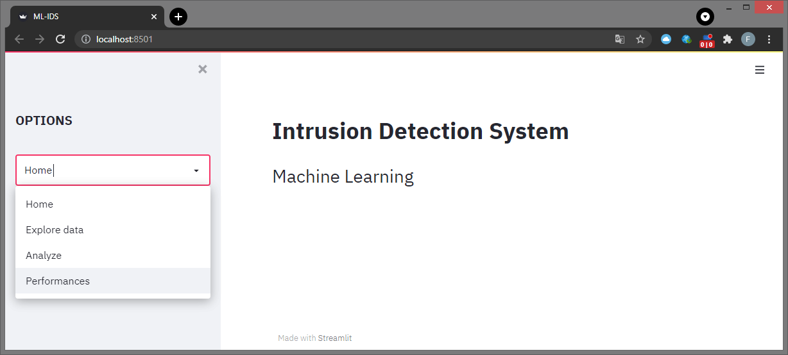

# IDS-ML
implementation of an intrusion detection system using ensemble machine learning methods

## Data set
This project is carried out using the [UNSW-15](https://research.unsw.edu.au/projects/unsw-nb15-dataset) data set 

## Technologies 
- [Python](https://www.python.org/)
- [Streamlit](https://streamlit.io/)
- [Zeek](https://zeek.org/)
- [Argus](https://pkgs.org/download/argus-client)

## Tools 
- [Pandas](https://pandas.pydata.org/)
- [Numpy](https://numpy.org/)
- [Scikit-learn](https://scikit-learn.org/)
- [Matplotlib](https://matplotlib.org/)
- [Seaborn](https://seaborn.pydata.org/)

## Operating Systems
- Windows
- Linux (required for analyse operation)

## Structure 

- ***main.py*** : This is the main page of the application, it calls the functions defined in the other files. The application is launched by typing : **streamlit run main.py**

When launching the application, the following welcome image appears with all the features available in the IDS 

## Functionalities
- **EDA (Exploratory Data Analysis)**
  - Demo
  -
- **Performances**
- **Analyze pcap file**
